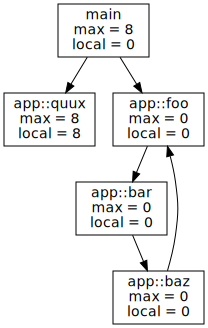

# **Functions**

## **Introduction**
A [function](https://www.tutorialspoint.com/computer_programming/computer_programming_functions.htm#:~:text=A%20function%20is%20a%20block,perform%20a%20single%2C%20related%20action.&text=Different%20programming%20languages%20name%20them,%2Droutines%2C%20procedures%2C%20etc.) is a block of organized, reusable code that is used to perform a single, related action. Functions provide modularity for applications and a high degree of code reusing. Build-in functions are functions provided by the language itself, but we can write our own functions as well. Important concepts about functions are **function name**, **parameter list**, **function body** and **return  type**. Functions needs to defined before we can call it and it only performs the code inside when called. 

## **Naming Rules**
There are many ways to name a function but the most common convention is: Function names should be **verbs** if the function changes the state of the program, and **nouns** if they're used to return a certain value. A part of this most languages have different conventions:

* **C#**: naming conventions generally follow the guidelines published by Microsoft for all .NET languages. The **Microsoft guidelines** recommend the exclusive use of only `PascalCase` and `camelCase`.
* **Go**: the convention is to use `MixedCaps` or `mixedCaps` rather than underscores to write multiword names. When referring to classes or functions, the **first letter specifies the visibility for external packages**. Making the first letter uppercase exports that piece of code, while lowercase makes it only usable within the current scope.
* **Java**: naming conventions for identifiers have been established and suggested by various Java communities. **Classes** uses `UpperCamelCase`, **Methods** uses `lowerCamelCase`, **Variables** uses `lowerCamelCase` and **Constants** should be written using `UPPERCASE`.
* **JavaScript**: The built-in JavaScript libraries use the same naming conventions as Java. Data types and constructor functions use `UpperCamelCase` and methods use `loverCamelCase`.
* **PHP**: According to [PSR-1](https://www.php-fig.org/psr/psr-1/) and [PSR-12](https://www.php-fig.org/psr/psr-12/), class names should be in `PascalCase`, class constants should be in `MACRO_CASE`, and method names should be in `camelCase`.
* **Python**: recommend `UpperCamelCase` for class names, `CAPITALIZED_WITH_UNDERSCORES` for constants, and `lowercase_separated_by_underscores` for other names.

### **JavaScript**
```js
// normal function declaration
function sum (num1, num2)  {
    return  num1 + num2;
}

sum(1, 2) // Call function
```
```js
// Variable Declaration
var sum = function (num1, num2) {
    return num1 + num2;
}

sum(1, 2) // Call function
```
```js
// Arrow function
const sum =  (num1, num2)  => num1 + num2;

sum(1, 2) // Call function
```
```js
//Self-called functions
(function (num1, num2) {
    return num1 + num2;
})(1, 2) // Call function
```

### **TypeScript**
It has the same way to declare functions of **JavaScript** with the difference you can declare the type of the return.

```ts
function sum (num1:number, num2:number): number {
    return num1 + num2;
}

sum(1, 2) // Call function
```

### **Java, C#**
```java
public int sum(int a, int b) {

return a + b;
}

sum(1, 2) // Call function
```

### **Python**
```py
def sum (num1, num2):
    return num1, num2

sum(1, 2) # Call function
```

### **PHP**
```php
<?php
function sum(int $a, int $b) {
  return $a + $b;
}

sum(1, 2); // Call function
?>
```

### **Go**

```go
func sum(num1 int, num2 int) int {

   return num1 + num2 
}

sum(1, 2) // Call function
```

## Scope and Closure
The [scope](https://en.wikipedia.org/wiki/Scope_(computer_science)) in computer science is the moment on the code where a certain functions lives and it's accessible. For better understanding check this article about [scope and variables](/programming-fundamentals/program-structure.md#scope-and-variable-types).

The term closure is often used as a synonym for [anonymous function](https://en.wikipedia.org/wiki/Anonymous_function) which is a function literal without a name, while a closure is an instance of a function, a value, whose non-local variables have been bound either to values or to storage locations.

```js
function sum (num1, num2) {

    function parse(num){
        return parseInt(num);
    }

    return parse(num1) + parse(num2) // This is the closure
}
```


### **What output does this function print by console ?** 
```js
var foo = function foo() {
    console.log(foo === foo);
};
foo();
```
On the example above the output we will receive on our console will be `true` as when  we call the function `foo()` what we are doing is checking if the  value of `foo` is strict equal `===` to it's value. 

### *What does this script returns ?**
```js
function bar() {
    return foo;
    foo = 10;
    function foo() {}
    var foo = '11';
}
alert(typeof bar());
```
On this case what we are doing is to `alert` the `typeof` the function `bar` which because it's a function it's `type` will be `function`.  


## Call Stack
In computer science, a [call stack](https://en.wikipedia.org/wiki/Call_stack) is a stack data structure that stores information about the active subroutines of a computer program. This is also known as an execution stack, program stack, control stack, run-time stack, or machine stack, and is often shortened to just "the stack".

 


## Recursive Functions
A [recursive function](https://en.wikipedia.org/wiki/Recursion_(computer_science)#:~:text=Recursive%20functions%20and%20algorithms,-A%20common%20computer&text=A%20recursive%20function%20definition%20has,program%20recurs%20(calls%20itself).) definition has one or more base cases, meaning input(s) for which the function produces a result trivially (without recurring), and one or more recursive cases, meaning input(s) for which the program recurs (calls itself). Recursion is so used on mathematic **series** or **treeWalkers**

```js
// Substract 1 to n, n numbers of times
function recursive(n) {
    if (n = 1) {
        return n;
    }

    return recursive(n-1);
}
```

### Base case in recursion  

```js
function chicken() {
    return egg(); 
}

function egg() {
    return chicken();
}

console.log(chicken() + " came first.");

```
As you can see  from the above code there is no base case. This means this code will run forever until the `Uncaught RangeError: Maximum call stack size exceeded` triggers. To  avoid this errors we should define when we would like to end the recursion and return the default case.

```js
function chicken(rand) {
    if (rand  >= 0.5) {
        return 'chicken';
    }

    return egg(Math.random()); 
}

function egg(rand) {
    if (rand < 0.5) {
        return 'egg';
    }

    return chicken(Math.random());
}

console.log(chicken(Math.random()) + " came first.");

```

Now with this code we return  `chicken` or  `egg` randomly and on each iteration we have random result.


