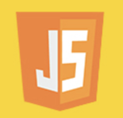
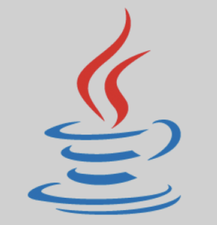
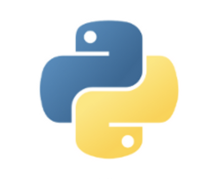
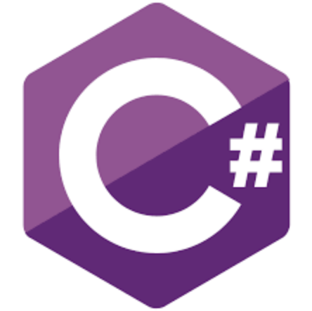

# **Program Structure**
On this module I have to go in deep on what we know as program structure, naming, conditionals and loops and iterations.

## Naming Rules
In [Computer Programming](https://en.wikipedia.org/wiki/Computer_programming) a [naming convention](https://en.wikipedia.org/wiki/Naming_convention_(programming)) is a set of rules for choosing the character sequence to be used for identifiers which denote variables, types, functions, and other entities in source code and documentation.

### Advantages
* provide additional information about the use to which an [identifier](http://aboutc.weebly.com/identifiers.html#:~:text=An%20identifier%20is%20a%20string,is%20a%20user%2Ddefined%20word.).
* help formalize expectations and promote [consistency](https://dl.acm.org/doi/10.1145/142868.142914#:~:text=An%20important%20aspect%20in%20the,system%20being%20designed%20and%20implemented.&text=Consistency%20of%20descriptions%20is%20defined,the%20interpretations%20of%20the%20descriptions.) within a development team.
* enable the use of [automated refactoring](https://www.sciencedirect.com/topics/computer-science/automated-refactorings) or search and replace tools.
* enhance the [aesthetic](https://darc.au.dk/research/research-agenda/aesthetic-programming/#:~:text=The%20term%20Aesthetic%20Programming%20thereby,implications%20of%20techno%2Dcultural%20systems.) and professional appearance of work product.
* help avoid ["naming collisions"](https://en.wikipedia.org/wiki/Naming_collision).
* provide meaningful data to be used in project handovers and better understanding.

### Disadvantages
* Each programming language uses it's own convention.
* Could be challenging to agree on a common naming.
* Automatic process could crash or underperform if not followed.

### Flat case
`flatcase` and `UPPERFLATCASE` are not commonly used as the readability is not really good when you have to deal with multiple words naming.

### Camel Case
`camelCase` borns in order to improve the readability of flat case convention. Is commonly used in JavaScript and java to name variables which are not constants. It's also used to name brands or products such as `iPhone` or `eBay`.  

### Pascal Case
`PascalCase` is commonly used to name Pascal, Java and JavaScript class and interface files.

### Snake Case
`snake_case` used in python to name variables, functions and methods. Personally I like this naming a lot as readability is very good.
`SCREAMING_SNAKE_CASE` also known as `MACRO_CASE` is a good practice to name constant variables and C processor macros.

### Kebab Case
`kebab-case` doesn't have a defined convention but on my personal case I like to use it for folder and repository naming.
`TRAIN-CASE` is the same concept but with capitalized letters.
`HTTP-Header-Case` is an extended convention to name HTTP request headers.   

### [More about naming](https://en.wikipedia.org/wiki/Letter_case#Special_case_styles)

## Reserved words vs keywords
* **Reserved words:** are words that cannot be used as an identifier, such as the name of  a variable, function, label ... This is a syntactic definition, and a [reserved word](https://en.wikipedia.org/wiki/Reserved_word#:~:text=In%20a%20computer%20language%2C%20a,word%20may%20have%20no%20meaning.) may have no meaning.
* **Keywords:** are reserved words as a string of characters will unambiguously be either a [keyword](https://www.webopedia.com/TERM/K/keyword.html#:~:text=(2)%20In%20programming%2C%20a,are%20sometimes%20called%20reserved%20names%20.) or an identifier, usually a subset of reserved words.

<a href="https://developer.mozilla.org/es/docs/Web/JavaScript">
    
</a>

### JavaScript [keywords](https://developer.mozilla.org/en-US/docs/Web/JavaScript/Reference/Lexical_grammar)
```js
await break case catch class const continue debugger default delete do
else enum export extends false finally for function if implements import
in instanceof interface let new null package private protected public
returnsuper switch static this throw try True typeof var void while with yield
```
<br>
<a href="https://docs.oracle.com/en/java/">
    
</a>

### Java [keywords](https://en.wikibooks.org/wiki/Java_Programming/Keywords)
```java
abstract assert boolean break byte case catch char class const continue default
do double else enum extends final finally float for goto if implements import instanceof
int interface long native new package private protected public return short static
strictfp super switch synchronized this throw throws transient try void volatile while
```
<br>
<a href="https://docs.python.org/3/">
    
</a>

### Python [keywords](https://realpython.com/lessons/reserved-keywords/)
```python
False def if raise None del import return True elif in try and else is while as except
lambda with assert finally nonlocal yield break for not class from or continue global pass
```
<br>
<a href="https://golang.org/doc/">
    
</a>

### Go [keywords](https://notes.shichao.io/golang/#:~:text=Keywords%20or%20reserved%20words%20are,%2C%20import%20%2C%20return%20%2C%20var%20)
```go
break default func interface select case defer go map struct chan else goto package
switch const fallthrough if range type continue for import return var
```
<br>
<a  href="php.net/docs.php">
    
</a>

### PHP [keywords](https://www.php.net/manual/en/reserved.keywords.php)
```php
__halt_compiler() abstract and array() as break callable case catch class clone const
continue declare default die() do echo else elseif empty() enddeclare endfor 
endforeach endif endswitch endwhile eval() exit() extends final finally fn for foreach 
function global goto if implements include include_once instanceof insteadof interface 
isset() list() namespace new or print private protected public require require_once 
return static switch throw trait try unset() use var while xor yield yield from
```
<br>
<a href="https://docs.microsoft.com/es-es/dotnet/csharp/">
    
</a>

### C# [keywords](https://docs.microsoft.com/en-us/dotnet/csharp/language-reference/keywords/)
```c#
abstract as base bool break byte case catch char checked class const continue decimal 
default delegate do double else enum event explicit extern false finally fixed float 
for foreach goto if implicit in int interface internal is lock long namespace new null 
object operator out override params private protected public readonly ref return sbyte
sealed short sizeof stackalloc static string struct switch this throw true try typeof
uint ulong unchecked unsafe ushort using virtual void volatile
```
<br>

## Scope and Variable types
the strict definition of [scope](https://en.wikipedia.org/wiki/Scope_(computer_science)) is the portion of source code in which a binding of a name with an entity applies. In other words is the fraction of the code on which an identifier is accessible. Depending on the scope we can classify different variables:

* **Local Variables**: Exists only in a specific function execution time.
* **Autogenerated Variables**: Variables which are generated and removed automatically when the function ends
* **Global Variables**: Accessible since the start until the end oof the execution of the program 
* **Extern Variables**: Shared variables cross files
* **Constant Variables**: Variables which value is immutable and can not be modified

For further information about variables check the [Values, Types and Operators](/programming-fundamentals/values-types-operators.md#Variables) :books: .

## Comments
Comments if used must always provide extra value. It Can be single or multiple lines. Best practices requires to make the code [self-readable and self-explanatory](https://en.wikipedia.org/wiki/Self-documenting_code#:~:text=Self%2Ddocumenting%20code%20is%20ostensibly,symbol's%20meaning%2C%20such%20as%20article.&text=The%20code%20must%20also%20have,easily%20understand%20the%20algorithm%20used.) in order to avoid comments as much as possible.

## Single line comments
```js
// In JavaScript, Java, Go, PHP and C based languages we use double slash `//`
```

```python
# Python and Bash uses sharp `#` at the beggining of the line to mark it as a comment
```

## Multiple line comments
```js
/* JavaScript, Java, Go, PHP and C based languages text
placed between / * and * / are considered as 
multiple line comments or block comments */
```

```python
# Python, Bash and other languages we use #
# at the beggining of each line we want
# to comment as there are no multiple line comments
```

## Functions
In programming, a named section of a program that performs a specific task. In this sense, a function is a type of procedure or routine. Some programming languages make a distinction between a function, which returns a value, and a procedure, which performs some operation but does not return a value

### Parameters vs arguments
**Parameters:** are variables in a method or function definition
**Arguments:** is the given data to a function when it is called

### Return Values
Are just what they sound like — the values that a function returns when it has completed.
`return` keyword is usually used to store the output of a function in a variable of the upper scope.

### JavaScript
```js
// ES5 function declaration
function fooFunction(parameter1, parameter2) {
    // method body

    return; // some value
}

//ES6 arrow function declaration as constant with template literal return
const fooArrowFunction = (...arguments) => {
    // method body

    return; // some value
}

//this is how invocation in JavaScript works
fooFunction(argument1, argument2);
fooArrowFunction(argument1, argument2);
```

### TypeScript
TypeScript enhance JavaScript and introduce the ability to set the type of the expected returned value.    
```ts
let myAdd = function (x: number, y: number): number {
  return x + y;
};

myAdd(number1, number2) // We already know it will be a number
```

### Java
```java
// This is the schema of how to declare Java functions
returnType methodName(param) {
  // method body

  return; // return data of type returnType
};

methodName(argument); // This is how invocation in Java works
```

### Python
```python
def fooFunction(param1):
    # method body

    return # return some data
```

### Go
```go
func avg(x float64, y float64) float64 {
    // method body

	return (x + y) / 2 // return  some data
}
```

### PHP
On a PHP file it's possible to run also plain HTML code so we need to add the `<?php ?>` tag in order to run the PHP code
```php
<?php
function fooFunction() {
  echo "Hello world!";
}

fooFunction(); // call the function
?>
```

### C#
```c#
// General schema on how functions are declared
<Access Specifier> <Return Type> <Method Name>(Parameter List) {
   Method Body
}

class NumberManipulator {
   public int FindMax(int num1, int num2) {
      /* local variable declaration */
      int result;

      if (num1 > num2)
         result = num1;
      else
         result = num2;

      return result;
   }
}
```

## Loops vs Iterators
The difference is quite subtle indeed. Both loops and iterators are used to repeat a chunk of code. Loops are an ancient idea, they existed long before computers did. Almost every programming language has some kind of loops. Iterators are relatively new, and they only exist in a few languages such as Ruby.

* **Loops:** are both powerful and dangerous: it’s too easy to break your program by producing a so called infinite loop, if you fail to ensure that the termination condition really occurs.
* **Iterators:** are conceptually used to perform a task on each data item.

### For

#### JavaScript
```js
for(var i = 0; i < 5; i++) {
    // perform a given task 5 loops
}
```

#### TypeScript
```ts
for (var _i = 0; _i < numbers.length; _i++) {
  var num = numbers[_i];
  console.log(num);
}
```

#### Java
```java
for (int i = 0; i < 5; i++) {
  System.out.println(i);
}
```

#### Go
```go
for i := 0; i < 10; i++ {
    sum += i
}
```

#### PHP
```php
<?php
    for ($i = 1; $i <= 10; $i++) {
        echo $i;
    }
?>
```

#### C#
```c#
for (int i = 0; i < 5; i++)
{
    Console.WriteLine(i);
}
```

### While

#### JavaScript
```js
while (condition) {
  // code block to be executed
}
```
#### TypeScript
```ts
while (condition expression) {
    // code block to be executed
}
```

#### Java
```java
while (condition) {
  // code block to be executed
}
```
#### Python
```python
i = 1
while i < 6:
  print(i)
  i += 1
```

#### PHP
```php
<?php
    $x = 1;

    while($x <= 5) {
    echo "The number is: $x <br>";
    $x++;
    }
?>
```
#### C#
```c#
while (condition) 
{
  // code block to be executed
}
```

### For In

#### JavaScript
```js
for (const property in object) {
  console.log(`${property}: ${object[property]}`);
}
```

#### TypeScript
```ts
for (const property in object) {
  console.log(`${property}: ${object[property]}`);
}
```

#### Python
```python
fruits = ["apple", "banana", "cherry"]
for x in fruits:
  print(x)
  if x == "banana":
    break
```

### For Each

#### JavaScript
```js
array1.forEach(element => console.log(element));
```

#### TypeScript
```ts
array1.forEach(element => console.log(element));
```

#### Java
```java
for (type variableName : arrayName) {
  // code block to be executed
}
```

#### Go
```go
a := []string{"Foo", "Bar"}
for i, s := range a {
    fmt.Println(i, s)
}
```

#### PHP
```php
<?php
$arr = array(1, 2, 3, 4);

foreach ($arr as $key => $value) {
    // $arr[3] will be updated with each value from $arr...
    echo "{$key} => {$value} ";
    print_r($arr);
}
?>
```

#### C#
```c#
foreach (type variableName in arrayName) 
{
  // code block to be executed
}
```

## Dive-in the language

### JavaScript
[Official documentation](https://wiki.developer.mozilla.org/en-US/docs/Web/JavaScript) <br>
[Tutorials](https://wiki.developer.mozilla.org/en-US/docs/Web/JavaScript) <br>
[References](https://wiki.developer.mozilla.org/en-US/docs/Web/JavaScript/Reference)

### TypeScript
[Official documentation](https://www.typescriptlang.org/docs/) <br>
[Community](https://www.typescriptlang.org/community) <br>
[Playground](https://www.typescriptlang.org/play?#code/PTAEHUFMBsGMHsC2lQBd5oBYoCoE8AHSAZVgCcBLA1UABWgEM8BzM+AVwDsATAGiwoBnUENANQAd0gAjQRVSQAUCEmYKsTKGYUAbpGF4OY0BoadYKdJMoL+gzAzIoz3UNEiPOofEVKVqAHSKymAAmkYI7NCuqGqcANag8ABmIjQUXrFOKBJMggBcISGgoAC0oACCoASMFmgY7p7ehCTkVOle4jUMdRLYTqCc8LEZzCZmoNJODPHFZZXVtZYYkAAeRJTInDQS8po+rf40gnjbDKv8LqD2jpbYoACqAEoAMsK7sUmxkGSCc+VVQQuaTwVb1UBrDYULY7PagbgUZLJH6QbYmJAECjuMigZEMVDsJzCFLNXxtajBBCcQQ0MwAUVWDEQNUgADVHBQGNJ3KAALygABEAAkYNAMOB4GRogLFFTBPB3AExcwABT0xnM9zsyhc9wASmCKhwDQ8ZC8iElzhB7Bo3zcZmY7AYzEg-Fg0HUiS58D0Ii8AoZTJZggFSRxAvADlQAHJhAA5SASAVBFQAeW+ZF2gldWkgx1QjgUrmkeFATgtOlGWH0KAQiBhwiudokkuiIgMHBx3RYbC43CCJSAA) <br>
[Tools](https://www.typescriptlang.org/play?#code/PTAEHUFMBsGMHsC2lQBd5oBYoCoE8AHSAZVgCcBLA1UABWgEM8BzM+AVwDsATAGiwoBnUENANQAd0gAjQRVSQAUCEmYKsTKGYUAbpGF4OY0BoadYKdJMoL+gzAzIoz3UNEiPOofEVKVqAHSKymAAmkYI7NCuqGqcANag8ABmIjQUXrFOKBJMggBcISGgoAC0oACCoASMFmgY7p7ehCTkVOle4jUMdRLYTqCc8LEZzCZmoNJODPHFZZXVtZYYkAAeRJTInDQS8po+rf40gnjbDKv8LqD2jpbYoACqAEoAMsK7sUmxkGSCc+VVQQuaTwVb1UBrDYULY7PagbgUZLJH6QbYmJAECjuMigZEMVDsJzCFLNXxtajBBCcQQ0MwAUVWDEQNUgADVHBQGNJ3KAALygABEAAkYNAMOB4GRogLFFTBPB3AExcwABT0xnM9zsyhc9wASmCKhwDQ8ZC8iElzhB7Bo3zcZmY7AYzEg-Fg0HUiS58D0Ii8AoZTJZggFSRxAvADlQAHJhAA5SASAVBFQAeW+ZF2gldWkgx1QjgUrmkeFATgtOlGWH0KAQiBhwiudokkuiIgMHBx3RYbC43CCJSAA)

### Java
[Official documentation](https://docs.oracle.com/en/java/) <br>
[Version history](https://en.wikipedia.org/wiki/Java_version_history)

### Python
[Official documentation](https://docs.python.org/3/) <br>
[PyPi](https://pypi.org/) <br>
[Community](https://www.python.org/community-landing/)

### Go
[Official documentation](https://golang.org/doc/) <br>
[The Project](https://golang.org/project/) <br>
[Blog](https://blog.golang.org/)

### PHP
[Official documentation](https://www.php.net/docs.php)

### C#
[Official documentation](https://docs.microsoft.com/en-us/dotnet/csharp/) <br>
[What's new](https://docs.microsoft.com/en-us/dotnet/csharp/)
