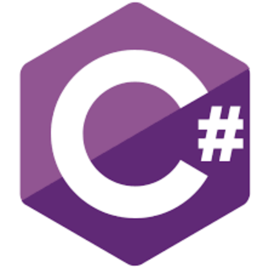

# **values-types-operators**
On this project I had to investigate and understand in deep about the basics of programming and about the most common values, types and operators.

## **Programming Languages**
In poor words a [programming language](https://en.wikipedia.org/wiki/Programming_language) is a set of instructions a computer can follow to resolve a task.

There are 3 main concepts:

* **Function and Target:**
Programming languages differ from [Natural Languages](https://en.wikipedia.org/wiki/Natural_language) in that natural languages are only used for interaction between people, while programming languages also allow humans to communicate instructions to machines.

*  **Abstractions:**
Each significant piece of functionality in a program should be implemented in just one place in the source code. Where similar functions are carried out by distinct pieces of code, it is generally beneficial to combine them into one by abstracting out the varying parts. This is known as the [Abstraction Principal](https://en.wikipedia.org/wiki/Abstraction_principle_(computer_programming)#:~:text=In%20software%20engineering%20and%20programming,abstractions%20provided%20by%20the%20programming).

* **Expressive Power:**
The [Theory of Computation](https://en.wikipedia.org/wiki/Theory_of_computation) classifies languages by the computations they are capable of expressing. All Turing complete languages can implement the same set of algorithms. ANSI/ISO SQL-92 and Charity are examples of languages that are not Turing complete, yet are often called programming languages.

## Variables
A variable is the name you give to computer [memory location](https://www.sciencedirect.com/topics/engineering/memory-location) which is used to store values in a computer program. [Global variables](https://en.wikipedia.org/wiki/Global_variable) are accessible at any moment since the program starts until it ends. [Local variables](https://en.wikipedia.org/wiki/Local_variable) are created inside a [function](https://www.tutorialspoint.com/computer_programming/computer_programming_functions.htm#:~:text=A%20function%20is%20a%20block,perform%20a%20single%2C%20related%20action.&text=Different%20programming%20languages%20name%20them,%2Droutines%2C%20procedures%2C%20etc.) and are only accessible in the scope of that function.

**Parameter** | **Local** | **Global**
--- | --- | ---
[**Scope**](https://en.wikipedia.org/wiki/Scope_(computer_science)) | Declared inside a function | Declared outside the function
[**Value**](https://www.ibm.com/support/knowledgecenter/en/SSLTBW_2.3.0/com.ibm.zos.v2r3.ikjc300/ikj2g2_Variable_Values.htm) | If not initialized, a garbage value is stored | If not initialized zero is stored as default.
[**Lifetime**](https://en.wikipedia.org/wiki/Object_lifetime) | Created when the function starts and lost when the functions terminates | Created before the program's global execution starts and lost when the program terminates.
[**Data sharing**](https://en.wikipedia.org/wiki/Data_sharing) | Not possible as data can be accessed only by one function | Possible as multiple functions can access the same global variable.
[**Parameters**](https://en.wikipedia.org/wiki/Parameter_(computer_programming)) | Required for local variables to access the value | Not necessary as it is visible throughout the program
**Modification of variable** | When the value is modified, the changes are not visible in another function | When the value is modified the changes are visible in the rest of the program.
**Accessed by** | Can be accessed with the help of statements, inside a function | Accessible by any statement in the program.
[**Memory storage**](https://www.sciencedirect.com/topics/engineering/program-memory) | Stored on the stack unless specified | Stored on a fixed location decided by the compiler.

### Advantages of using Global variables
* You can access the global variable from all the functions or modules in a program
* You only require to declare global variable single time outside the modules.
* It is ideally used for storing "constants" as it helps you keep the consistency.
* A Global variable is useful when multiple functions are accessing the same data.

### Advantages of using Local Variables
* The use of local variables offer a guarantee that the values of variables will remain intact while the task is running
* If several tasks change a single variable that is running simultaneously, then the result may be unpredictable. But declaring it as local variable solves this issue as each task will create its own instance of the local variable.
* You can give local variables the same name in different functions because they are only recognized by the function they are declared in.
* Local variables are deleted as soon as any function is over and release the memory space which it occupies.

### Disadvantages of using Global Variables
* Too many variables declared as global, then they remain in the memory till program execution is completed. This can cause of Out of Memory issue.
* Data can be modified by any function. Any statement written in the program can change the value of the global variable. This may give unpredictable results in multi-tasking environments.
* If global variables are discontinued due to code refactoring, you will need to change all the modules where they are called.

### Disadvantages of using Local Variables
* The debugging process of a local variable is quite tricky.
* Common data required to pass repeatedly as data sharing is not possible between modules.
* They have a very limited scope.

### What is more useful?
The local and global variable equally important while writing a program in any language. However, a large number of the global variable may occupy a huge memory. An undesirable change to global variables is become tough to identify. Therefore, it is advisable to avoid declaring unwanted global variables.

## Data types
Attribute of data which tells the compiler or interpreter how the programmer intends to use the data.

### Primitive data types
* **Integer numbers:** An [integer](https://press.rebus.community/programmingfundamentals/chapter/integer-data-type/) data type represents some range of mathematical integers.
* **Fixed-point numbers:** A [fixed-point number](https://www.mathworks.com/help/dsp/ug/concepts-and-terminology.html) represents a limited-precision rational number that may have a fractional part.
* **Booleans:** A [boolean](https://en.wikipedia.org/wiki/Boolean_data_type) type is typically a logical type that can have either the value `true` or the value `false`.  
* **Characters:** [Char](https://www.ibm.com/support/knowledgecenter/SSGU8G_11.50.0/com.ibm.glsug.doc/ids_gug_117.htm) is defined as the smallest addressable unit of memory.
* **Strings:** Characters may be combined into [strings](https://press.rebus.community/programmingfundamentals/chapter/string-data-type/). The string data can include numbers and other numerical symbols but is treated as text.

### Composite types
* **Array:** An [array](https://en.wikipedia.org/wiki/Array_data_type#:~:text=In%20computer%20science%2C%20an%20array,array%20value%2C%20or%20simply%20array.) stores a number of elements and provide access to individual elements. [2D arrays](https://www.mathworks.com/help/matlab/math/multidimensional-arrays.html) stores a number defined number of arrays.
* **Union:** A [union](https://en.wikipedia.org/wiki/Union_type#:~:text=In%20computer%20science%2C%20a%20union,describe%20such%20values%20and%20variables.) type definition will specify which of a number of permitted primitive types may be stored in its instances.
* **Record:** A [record](https://en.wikipedia.org/wiki/Record_(computer_science)#:~:text=A%20record%20type%20is%20a,which%20it%20can%20be%20accessed.) is a value that contains other values, typically in fixed number and sequence and typically indexed by names.

### Abstract data types
Any data type that does not expatiate on the concrete representation of the data is an [abstract data type](https://en.wikipedia.org/wiki/Abstract_data_type#:~:text=In%20computer%20science%2C%20an%20abstract,the%20behavior%20of%20these%20operations.). Instead, a formal specification based on the data type's operations is used to describe it. Any implementation of a specification must fulfill the rules given. Abstract data types are used in [formal semantics](https://en.wikipedia.org/wiki/Semantics_(computer_science)) and program verification and, less strictly, in design.

### Other types
* **Pointers and References**: A [pointer](https://en.wikipedia.org/wiki/Pointer_(computer_programming)) is a data type whose value refers directly to another value stored elsewhere in the computer memory using its address. It is a primitive kind of [reference](https://en.wikipedia.org/wiki/Reference_(computer_science)). Pointers are often stored in a format similar to an integer; however, attempting to dereference or "look up" a pointer whose value was never a valid memory address would [cause a program to crash](https://en.wikipedia.org/wiki/Crash_(computing)#:~:text=In%20computing%2C%20a%20crash%2C%20or,any%20details%20relating%20to%20it.). To ameliorate this potential problem, pointers are considered a separate type to the type of data they point to.
* **Function Types**: Here, data is viewed as opposed to [algorithms]((https://en.wikipedia.org/wiki/Algorithm)). In programming, functions are strongly related to the later. But because a central motive of universal [data processing](https://en.wikipedia.org/wiki/Data_processing) is, that algorithms can be represented as data, the contrast of data and functions has its limits.
* **Meta Types**: Some programming languages represent the type information as data, enabling type [introspection and reflection](https://thecodeboss.dev/2016/02/programming-concepts-type-introspection-and-reflection/). To the contrary, higher order type systems, while allowing to construct types from other types and pass them through functions like they were values, typically avoid to base computational decisions on them.
* **Utility Types**: For convenience, high-level languages may supply ready-made "real world" data types, for instance times, dates and monetary values and memory, even where the language allows them to be built from primitive types.

## Logical operators
* **AND**: In classical programming, [AND](https://docs.microsoft.com/en-us/cpp/cpp/logical-and-operator-amp-amp?view=msvc-160) returns `true` if both operands are `true` and `false` otherwise.
* **OR**: In classical programming, the logical [OR](https://docs.microsoft.com/en-us/cpp/cpp/logical-or-operator-pipe-pipe?view=msvc-160) is meant to manipulate boolean values only. If any of its arguments are `true`, it returns `true`, otherwise it returns `false`.
* **NOT**: [Negation](https://docs.microsoft.com/en-us/cpp/cpp/logical-negation-operator-exclpt?view=msvc-160) converts the operand to boolean type: `true/false`. Returns the inverse value.

## Learn more

